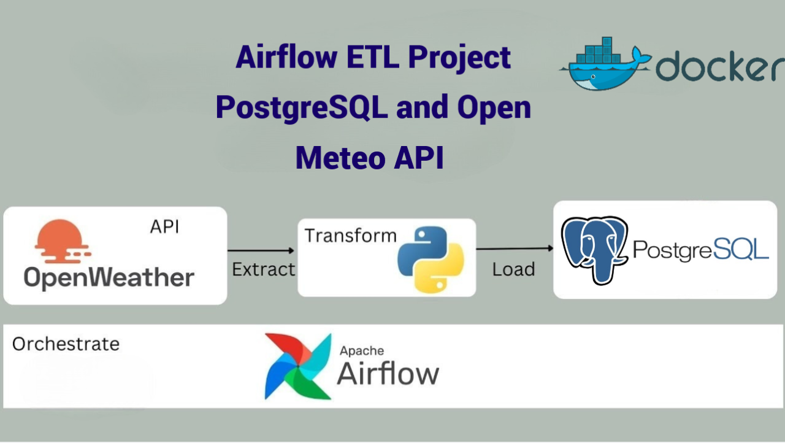

# **Airflow ETL Project: PostgreSQL and Open Meteo API Integration**

This project uses Apache Airflow to manage workflows that fetch weather data from the Open Meteo API, store it in a PostgreSQL database, and make it available for further analysis or reporting.

---

## **Project Overview**
This project involves:
- **Data Extraction**: Fetching weather data from the Open Meteo API.
- **Data Storage**: Storing the fetched data in a PostgreSQL database (`weather_data` table).
- **Workflow Orchestration**: Using Apache Airflow to schedule and manage the ETL process.

---

## **Architecture**


---

## **Setup Instructions**

### 1. **Set Up PostgreSQL**
Follow these steps to set up PostgreSQL and create the required database.

- Open pgAdmin and create a new server with the following details:
  - **Server Name**: `ps_db`
  - **Username**: `airflow`
  - **Password**: `airflow`
  - **Host Name/Address**: Retrieve the host IP address by running:
    ```bash
    docker inspect <container_id>
    ```
    Copy the `IPAddress` value from the output.
 
  


### 2. **Create Airflow Connections**
To connect PostgreSQL and the Open Meteo API in Airflow, follow these steps:

#### PostgreSQL Connection:
- Navigate to Airflow UI > Admin > Connections.
- Add a connection with the following details:
  - **Conn Id**: `postgres_default`
  - **Conn Type**: `Postgres`
  - **Host**: `<host-ip-from-docker>`
  - **Schema**: `postgres`
  - **Login**: `airflow`
  - **Password**: `airflow`
  - **Port**: `5432`

#### Open Meteo API Connection:
- In Airflow UI > Admin > Connections, add a new connection:
  - **Conn Id**: `open_meteo_api`
  - **Conn Type**: `HTTP`
  - **Host**: `https://api.open-meteo.com`

---

## **Workflow Explanation**

### 1. **DAG: `fetch_and_store_weather_data`**
- **Task 1**: `create_table`
  - Creates the `weather_data` table in the PostgreSQL database.
  
- **Task 2**: `fetch_weather_data`
  - Fetches weather data from the Open Meteo API using the Airflow `HttpOperator`.

- **Task 3**: `insert_weather_data`
  - Inserts the fetched weather data into the PostgreSQL `weather_data` table.

### 2. **Table Schema**
```sql
CREATE TABLE weather_data (
    id SERIAL PRIMARY KEY,
    location TEXT NOT NULL,
    temperature DOUBLE PRECISION,
    humidity DOUBLE PRECISION,
    wind_speed DOUBLE PRECISION,
    timestamp TIMESTAMP DEFAULT CURRENT_TIMESTAMP
);
```

---

## **Usage**

### 1. **Run the DAG**
- In the Airflow UI, trigger the DAG `fetch_and_store_weather_data`.

### 2. **Monitor Logs**
- You can view logs for each task within the Airflow UI to troubleshoot any issues during execution.

### 3. **Query the Database**
- Once the data is loaded, you can query the database to retrieve the weather data:
  ```sql
  SELECT * FROM weather_data;
  ```

---

## **Contributors**
- [MEROUANE BENELABDY](https://github.com/merouane-bn)
- MAHMOUD BOUJIR

---

By following these steps, you will be able to set up and run a fully automated ETL pipeline that fetches weather data from the Open Meteo API, stores it in PostgreSQL, and allows for analysis using Airflow.